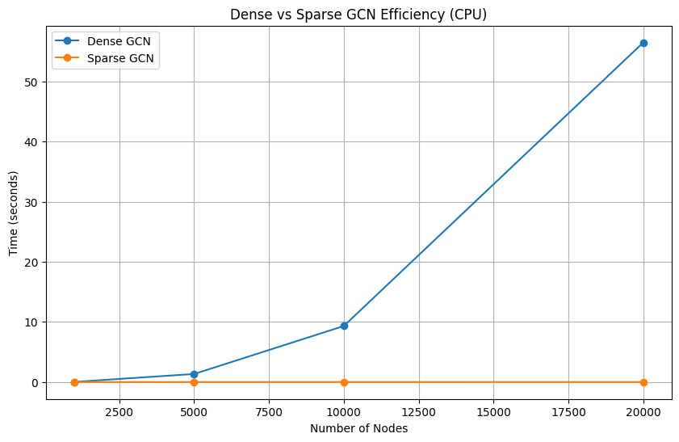

# GCN 模型实现与性能分析实验报告

## 1. 实验目的
1.  基于 PyTorch 实现稠密（Dense）与稀疏（Sparse）形式的图卷积网络（GCN）层。
2.  在 Cora 引文网络数据集上测试模型进行节点分类的性能。
3.  对比分析稠密与稀疏实现在不同规模图数据下的计算效率与内存占用。

## 2. 模型实现方法

### 2.1 稠密图卷积 (Dense GCN)
基于矩阵乘法实现，核心公式为：
$$\mathbf{H}^{(k+1)} = \sigma ( \mathbf{D}^{-\frac{1}{2}} \tilde{\mathbf{A}} \mathbf{D}^{-\frac{1}{2}} \mathbf{H}^{(k)} \mathbf{W} )$$
实现时预先计算归一化邻接矩阵，利用 PyTorch 的矩阵乘法进行特征变换与聚合。该方法需要存储完整的 $N \times N$ 邻接矩阵。

### 2.2 稀疏图卷积 (Sparse GCN) [Bonus]
基于消息传递（Message Passing）机制实现，利用 `torch_scatter` 进行特征聚合。
* **输入**：仅需边索引 `edge_index` ($2 \times E$)。
* **过程**：Linear变换 -> 添加自环 -> 计算边权重 -> Gather消息 -> Scatter聚合。
* **优势**：无需构建稠密矩阵，仅针对存在的边进行计算。
## 3. 实验结果与分析

### 3.1 Cora 数据集节点分类性能
* **实验设置**：2层 GCN，Hidden Size=16，Dropout=0.5，优化器 Adam (lr=0.01, weight_decay=5e-4)。
* **结果**：
    * **Test Accuracy**：约为 **81.4%**。
    * **收敛情况**：训练集准确率迅速达到 100%，Loss 平滑下降。
* **分析**：
    * 实验获得的 81.4% 准确率与相关文献报道的基准性能相符。
    * 模型在训练集表现优异但在测试集难以进一步提升，主要原因是 过拟合。由于 Cora 图规模较小（仅 2708 个节点），且标签样本较少，深层网络或过度训练容易拟合噪声，这是小图数据集上的常见瓶颈。

### 3.2 效率与扩展性对比 (Benchmark)
通过生成不同规模的 Erdos-Renyi 随机图（$N$ 从 1k 到 100k），对比两种实现的运行时间与内存消耗。

* **时间复杂度分析**：
    * **Dense GCN**：计算耗时随节点数 $N$ 呈平方级增长，复杂度为 $O(N^2)$。
    * **Sparse GCN**：计算耗时随边数 $E$ 线性增长，复杂度为 $O(E)$。
    * **结论**：在节点数较少时（$N < 5k$），两者差异不明显；当 $N$ 增大时，Dense 版本耗时显著增加，而 Sparse 版本保持极低耗时。

* **空间复杂度与内存限制**：
    * **Dense GCN**：内存占用为 $O(N^2)$。实验中当 $N \approx 50k$ 时，显存/内存消耗达到瓶颈，导致 OOM。
    * **Sparse GCN**：内存占用为 $O(E)$。由于benchmark本身的内存消耗，在$N \approx 100k$时，内存超限。(服务器结果，本地结果50k kernel崩溃)

## 4. 实验结论
1.  **性能验证**：手写的 GCN 模块在标准数据集上能够正常收敛。
2.  **稀疏性优势**：
    * 对于现实世界中常见的稀疏图（满足条件 $E \ll N^2$），稀疏图卷积具有压倒性的优势。
    * 稠密图卷积受限于 $O(N^2)$ 的时间和空间复杂度，仅适用于小图场景；在大规模图数据（如 $N > 20k$）上，必须采用稀疏实现以避免计算资源耗尽。