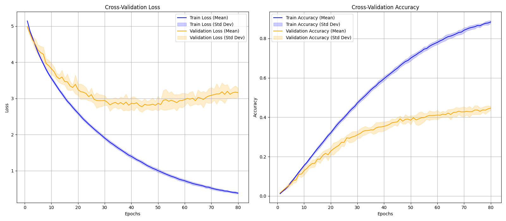
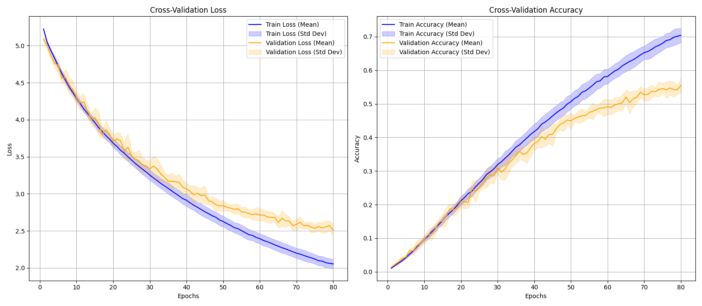

# 机器学习概论 课程项目1

## 1. 引言

本项目旨在利用卷积神经网络（CNN）对 CUB-200-2011 鸟类数据集进行细粒度图像分类。由于该任务涉及高相似度类别间的判别，对模型特征提取能力和泛化性提出了挑战。我们设计并实现了一个类 VGG 结构的轻量级 CNN 模型，并使用 **十折交叉验证** 评估了其性能，以确保评估结果的鲁棒性。

## 2. 模型架构设计

### 2.1. LightCNN 结构概述

我们设计的 `LightCNN` 采用 $N=5$ 个卷积块，然后接一个两层的 MLP 分类头。模型的输入尺寸为 $224 \times 224 \times 3$，最终输出 200 个类别的预测得分。

### 2.2. 模型细节与参数量

| 模块 | 结构 | 输出尺寸 (H × W × C) | 参数量 (Params) |
| :--- | :--- | :--- | :--- |
| **输入** | - | $224 \times 224 \times 3$ | - |
| **Layer 1** | Conv(3, 32) + BN + ReLU + MaxPool | $112 \times 112 \times 32$ | 864 |
| **Layer 2** | Conv(32, 64) + BN + ReLU + MaxPool | $56 \times 56 \times 64$ | 18,432 |
| **Layer 3** | Conv(64, 128) + BN + ReLU + MaxPool | $28 \times 28 \times 128$ | 73,728 |
| **Layer 4** | Conv(128, 256) + BN + ReLU + MaxPool | $14 \times 14 \times 256$ | 294,912 |
| **Layer 5** | Conv(256, 512) + BN + ReLU + MaxPool | $7 \times 7 \times 512$ | 1,179,684 |
| **池化** | AdaptiveAvgPool2d | $1 \times 1 \times 512$ | - |
| **分类头** | FC(512 $\rightarrow$ 1024) $\rightarrow$ ReLU $\rightarrow$ Dropout(0.5) $\rightarrow$ FC(1024 $\rightarrow$ 200) | 200 | 730,312 |
| **总计** | - | - | 2.3M |

## 3. 实验设置

### 3.1. 数据处理

* **数据集:** CUB-200-2011（11,788 张图片，200 个鸟类亚种）
* **交叉验证:** 10 折
* **训练增强:** 色彩抖动，随机水平反转，随机旋转
* **归一化:** 使用 ImageNet 均值和标准差。

### 3.2. 训练配置

* **优化器:** AdamW
* **学习率 (LR):** 1e-3
* **批次大小 (Batch Size):** 128
* **总 Epoch 数:** 80
* **损失函数:** 对于原始模型，使用交叉熵损失；对于优化模型，带有 Label Smoothing 的交叉熵损失 (Label Smoothing $\alpha=0.1$)

### 3.3. 实验组设置

我们对比了两组配置，以评估正则化方法对模型泛化能力的影响。

| 实验组 | 网络结构 | 正则化策略 |
| :--- | :--- | :--- |
| **Baseline** | LightCNN | 仅使用 **Batch Normalization** |
| **Optimized** | LightCNN | **Batch Normalization + Dropout (0.5) + Weight Decay ($\lambda=1e-5$)** |

## 4. 实验结果与分析

### 4.1. 性能对比概览

使用十折交叉验证的**最终验证集**性能均值和标准差进行对比。

| 实验组 | 最终平均训练准确率 (Mean ± Std) | 最终平均验证准确率 (Mean ± Std) | 最佳验证准确率 (Max) |
| :--- | :--- | :--- | :--- |
| **Baseline** | 0.8837±0.0076 | 0.4462±0.0102 | 0.4673 |
| **Optimized** | 0.7039±0.0210 | 0.5544±0.0232 | 0.5963 |

### 4.2. 训练过程可视化分析

**图 1：** **基线模型** 10 折交叉验证平均 Loss 和 Accuracy 变化曲线（均值 $\pm$ 标准差包络图）。

**图 2：** **优化模型** 10 折交叉验证平均 Loss 和 Accuracy 变化曲线（均值 $\pm$ 标准差包络图）。

### 4.3. 过拟合现象分析

#### A. 基线模型 (未加正则化)

- 现象: 模型在训练集上取得了极高的准确率（平均达到 88.37%），而同期在验证集上的准确率仅为 44.62%。训练 Loss（平均 0.3774）与验证 Loss（平均 3.1600）之间存在巨大的鸿沟。

- 结论: 基线模型出现了严重的过拟合现象。模型记住了训练数据中的特有噪声和细节，未能学习到普适性的特征，泛化能力极差。

#### B. 优化模型 (加入正则化)

- 现象:
    - 训练准确率下降: 优化模型的训练准确率从基线模型的约 88% 显著下降至约 70.39%。这是 Dropout 和 Weight Decay 等正则化手段故意抑制模型容量的结果。

    - 验证准确率大幅提升: 验证准确率从基线模型的约 44.62% 提升至约 55.44%，最佳准确率达到 59.63%。

    - 泛化差距缩小: 训练准确率 (70.39%) 和验证准确率 (55.44%) 的差距（约 15%）虽然仍存在，但远小于基线模型（差距约 43%）。

    - Loss 差距缩小: 训练 Loss（平均 2.0534）和验证 Loss（平均 2.5113）之间的差距也明显缩小。

- 正则化效果: 成功缓解了过拟合。 引入 Dropout 和 Weight Decay 迫使模型学习更具鲁棒性的特征表示，显著提高了模型的泛化性能。尽管在训练集上表现有所下降（这是正则化预期会产生的副作用），但模型对未见数据的预测能力（验证准确率）得到了显著提升，实现了更好的泛化性。

### 5. 结论与展望

#### 5.1. 结论

本项目成功实现了基于 `LightCNN` 的鸟类图片分类器，并通过十折交叉验证进行了可靠的性能评估。实验结果表明，$0.5544\pm0.0232$ 的准确率为的性能是可接受的，尤其是在细粒度分类任务上。正则化策略，包括数据增强、Batch Normalization、Dropout 和 Weight Decay，是提升模型泛化能力，抑制过拟合的关键。

#### 5.2. 展望

未来可以尝试以下改进：
1.  **迁移学习:** 使用预训练的骨干网络（如 ResNet 或 EfficientNet）替换 LightCNN。
2.  **更强的正则化:** 尝试 CutMix 或 MixUp 等更激进的数据增强方法。
3.  **细粒度技巧:** 引入注意力机制（Attention Mechanism）或部位定位（Part Localization）等细粒度分类特有的方法。
