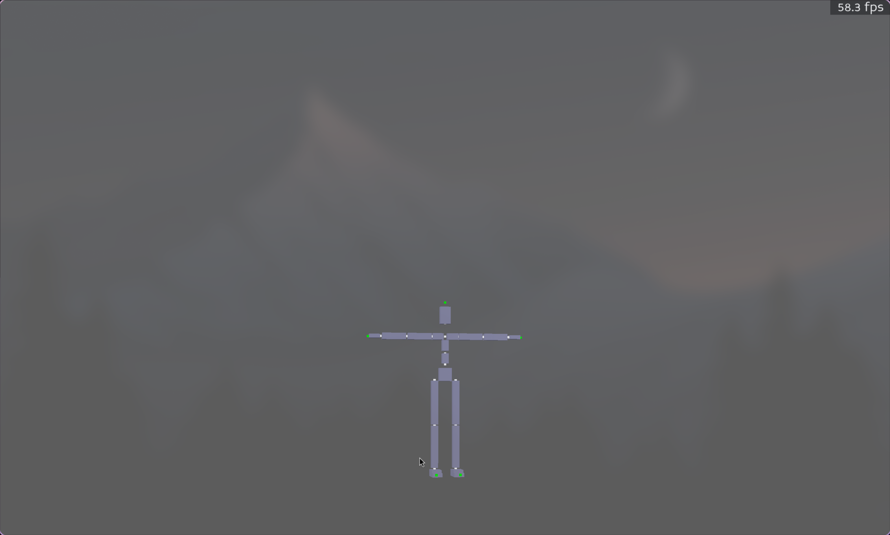
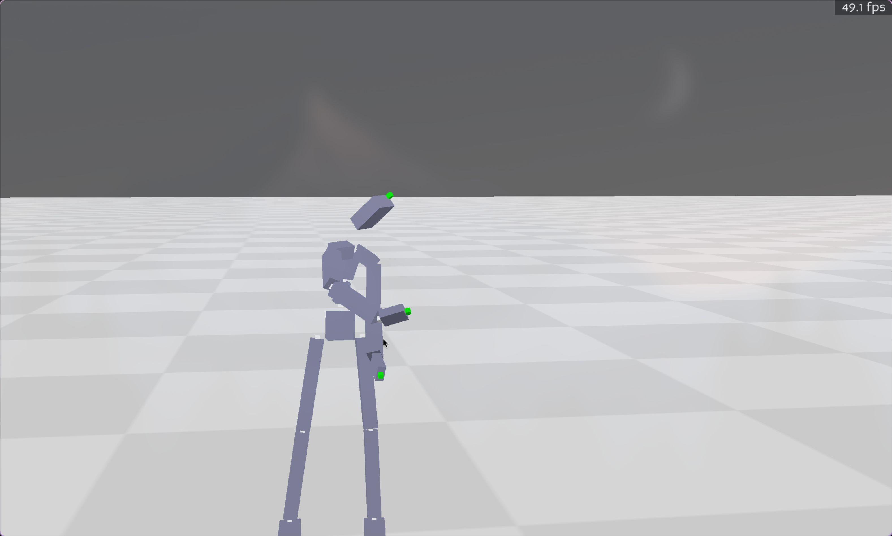
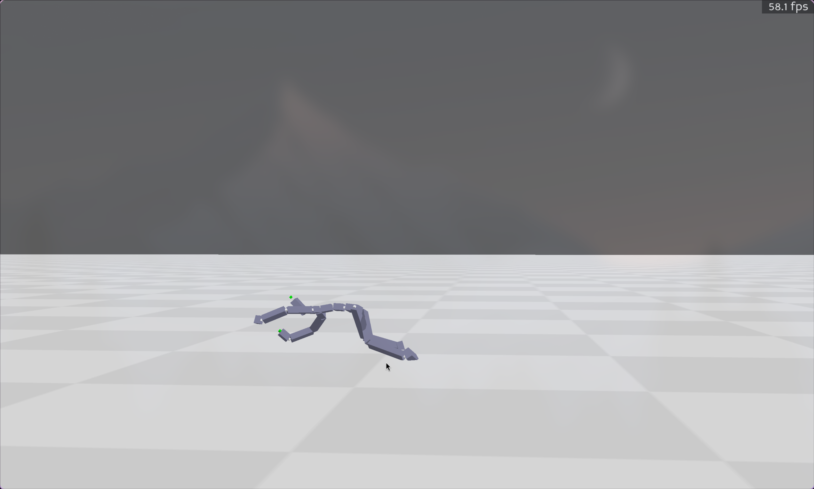
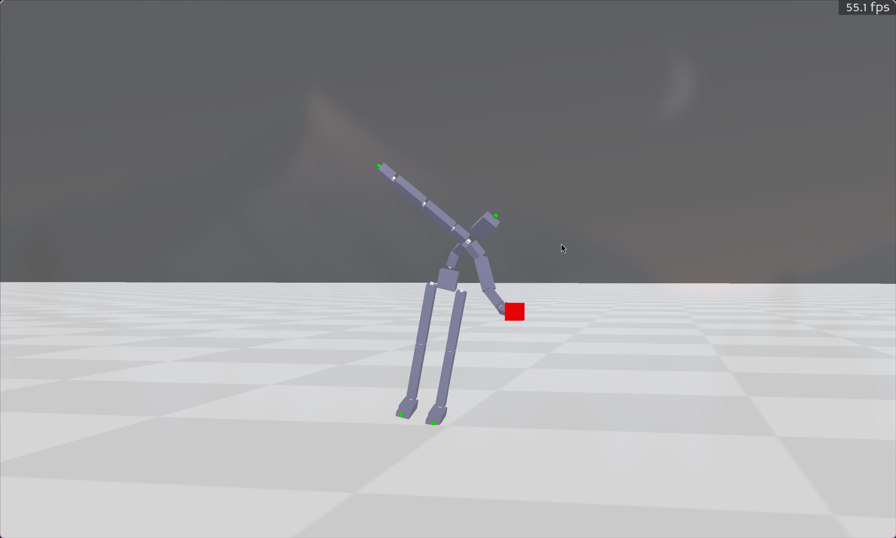
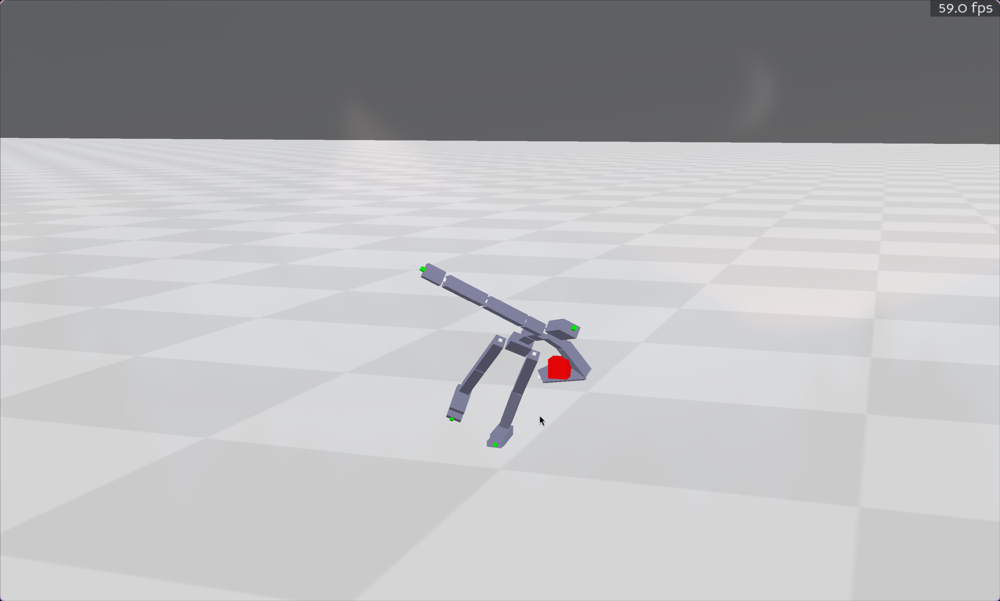
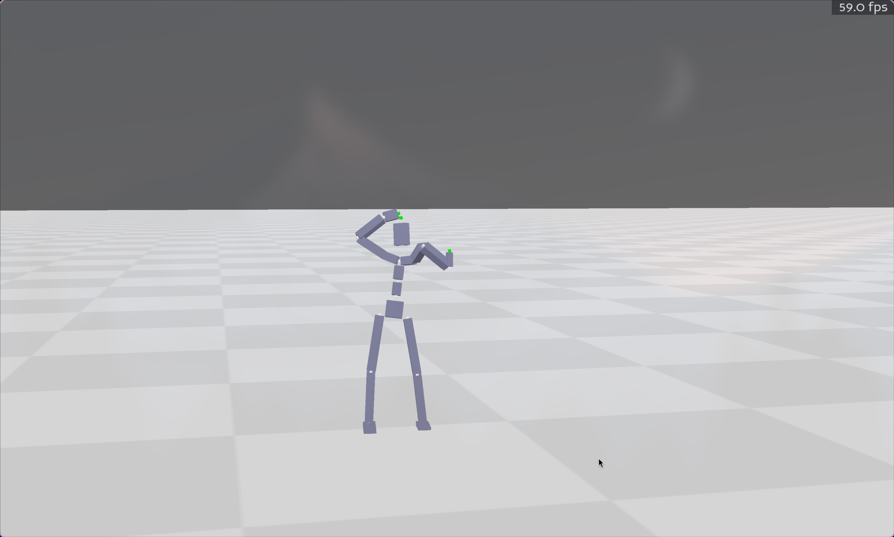

# MoCCA lab1 实验报告

## BVH 读取

为了读取层次化结构，我选择手动模拟堆栈，按照层次读取文件，根据栈顶元素添加parent节点。同时为了区分端点和关节，我给端点节点加入了`_end`后缀。结果见下。

## FK

在FK过程中，需要时刻根据当前的节点编号调整读取 motion 的位置。为了排除端点的影响，我设置了一个`current_channel`变量记录读取到哪个channel.其余部分使用标准的FK公式。结果见下，这是随机截取的动态中的一帧。

## Retarget

首先比对每个对应关节相对旋转角度（offset）的差，通过最小旋转 $\vec{a} = \vec{v}_T \times \vec{v}_A$ ， $\theta = \arccos(\frac{\vec{v}_T \cdot \vec{v}_A}{\|\vec{v}_T\| \|\vec{v}_A\|})$ 方法对每一帧的每个动作都进行逆向旋转后，进行正常的FK即可。这里只需要实现读取两文件、对齐、逆向旋转即可。结果见下，这是随机截取的一帧。

## IK

我实现的是 CCD 算法。标准的CCD做的是从根节点到目标节点的迭代，实现的是类似于机械臂的控制。对于这个问题，如果只做CCD,会导致模型脱节破裂。因此，我们要在做完CCD后保留每个小节点的局部旋转。在进行完IK后，进行一次FK的迭代，从而让模型结构保持完整。结果见下。

## IK2 鸡头稳定器

为了实现鸡头稳定器的功效，我们需要在FK计算结束的旋转上，计算出手腕节点的理论位置 $P_{wrist\_target} = P_{target} - Q_{palm\_up} \cdot \vec{d}$，然后使用 IK 将手腕旋转到对应位置。在此之后旋转手腕关节保持手掌处于正上的方向。结果见图。

