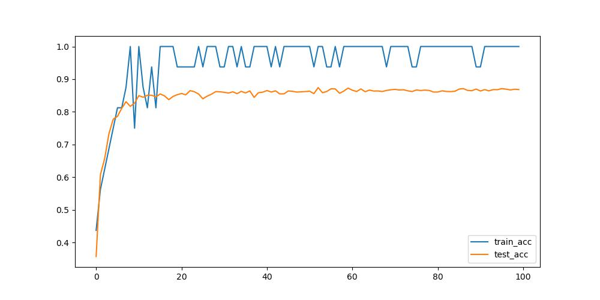
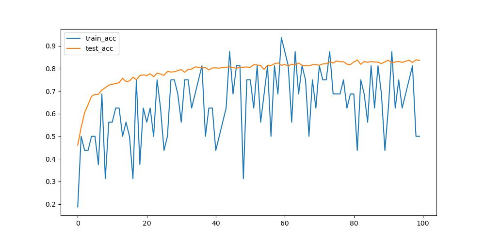
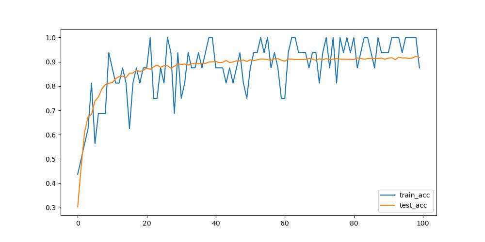

# 第二次作业实验报告

## 问题简述

通过PyTorch框架实现一个卷积神经网络（CNN），以实现对CIFAR-10数据集的图像分类。CIFAR-10数据集包含60,000张32x32彩色图像，分为10个类别，每个类别有6,000张图像。其中50,000张图像用于训练，10,000张用于测试。

## 网络设计

### VGG Net

上课讲解了VGG的结构和原理，利用多个较小的卷积层，可以获得比一个大的卷积层更好的效果。我的网络结构仿照VGG16构建。
为了适应任务，对网络全连接层的大小做了修改，fc1输入改为512,输出层输出改为10。


### my CNN

训练的时候发现VGG太大，参数太多，跑得太慢了，不能接受（），于是裁剪了VGG,只取其前2块（即4个卷积层和2个MaxPool），构成了My CNN。

这种模型跑起来比VGG16在效率上有明显的提升，然而效果有明显的下降，这也是不得不权衡的问题。

## 训练过程

由于VGG16实在是太大了，我这个小破机子跑一圈得跑一个半小时（），google colab的GPU又跑到时长上限了，所以下面都是基于my cnn 给出的调试。

### 模型结构微调

过拟合严重，测试集效果不好，于是在两个全连接层上都加了Dropout,p=0.2。

### optimizer

#### SGD

首先试试最基础的SGD。lr=0.005。跑了5个epoch,收敛不了一点。

```
Files already downloaded and verified
Files already downloaded and verified
MLU is not available, use GPU/CPU instead.
Epoch [1/100], Step [100/782], Loss: 2.2972, Accuracy: 18.75%
Epoch [1/100], Step [200/782], Loss: 2.2995, Accuracy: 7.81%
Epoch [1/100], Step [300/782], Loss: 2.2969, Accuracy: 10.94%
Epoch [1/100], Step [400/782], Loss: 2.2974, Accuracy: 7.81%
Epoch [1/100], Step [500/782], Loss: 2.2946, Accuracy: 7.81%
Epoch [1/100], Step [600/782], Loss: 2.2829, Accuracy: 15.62%
Epoch [1/100], Step [700/782], Loss: 2.2668, Accuracy: 18.75%
Test Accuracy of the model on the 10000 test images: 18.27 %
Epoch [2/100], Step [100/782], Loss: 2.1963, Accuracy: 20.31%
Epoch [2/100], Step [200/782], Loss: 2.1865, Accuracy: 25.00%
Epoch [2/100], Step [300/782], Loss: 2.1960, Accuracy: 21.88%
Epoch [2/100], Step [400/782], Loss: 1.9795, Accuracy: 25.00%
Epoch [2/100], Step [500/782], Loss: 2.0007, Accuracy: 32.81%
Epoch [2/100], Step [600/782], Loss: 1.8900, Accuracy: 32.81%
Epoch [2/100], Step [700/782], Loss: 2.0372, Accuracy: 21.88%
Test Accuracy of the model on the 10000 test images: 31.82 %
Epoch [3/100], Step [100/782], Loss: 2.0018, Accuracy: 20.31%
Epoch [3/100], Step [200/782], Loss: 2.1525, Accuracy: 29.69%
Epoch [3/100], Step [300/782], Loss: 2.0385, Accuracy: 29.69%
Epoch [3/100], Step [400/782], Loss: 1.9466, Accuracy: 25.00%
Epoch [3/100], Step [500/782], Loss: 1.8352, Accuracy: 34.38%
Epoch [3/100], Step [600/782], Loss: 1.9198, Accuracy: 28.12%
Epoch [3/100], Step [700/782], Loss: 1.8679, Accuracy: 35.94%
Test Accuracy of the model on the 10000 test images: 34.5 %
Epoch [4/100], Step [100/782], Loss: 1.7908, Accuracy: 35.94%
Epoch [4/100], Step [200/782], Loss: 1.7328, Accuracy: 32.81%
Epoch [4/100], Step [300/782], Loss: 1.8196, Accuracy: 32.81%
Epoch [4/100], Step [400/782], Loss: 1.8046, Accuracy: 32.81%
Epoch [4/100], Step [500/782], Loss: 1.9952, Accuracy: 34.38%
Epoch [4/100], Step [600/782], Loss: 1.6872, Accuracy: 48.44%
Epoch [4/100], Step [700/782], Loss: 1.7157, Accuracy: 45.31%
Test Accuracy of the model on the 10000 test images: 39.82 %
Epoch [5/100], Step [100/782], Loss: 1.7752, Accuracy: 34.38%
Epoch [5/100], Step [200/782], Loss: 1.7011, Accuracy: 42.19%
Epoch [5/100], Step [300/782], Loss: 1.6124, Accuracy: 43.75%
Epoch [5/100], Step [400/782], Loss: 1.7988, Accuracy: 26.56%
Epoch [5/100], Step [500/782], Loss: 1.7613, Accuracy: 39.06%
Epoch [5/100], Step [600/782], Loss: 1.7873, Accuracy: 28.12%
Epoch [5/100], Step [700/782], Loss: 1.8115, Accuracy: 32.81%
Test Accuracy of the model on the 10000 test images: 41.12 %
Epoch [6/100], Step [100/782], Loss: 1.8939, Accuracy: 40.62%
Epoch [6/100], Step [200/782], Loss: 1.6699, Accuracy: 37.50%
Epoch [6/100], Step [300/782], Loss: 1.6353, Accuracy: 43.75%
Epoch [6/100], Step [400/782], Loss: 1.7385, Accuracy: 35.94%
Epoch [6/100], Step [500/782], Loss: 1.4769, Accuracy: 45.31%
Epoch [6/100], Step [600/782], Loss: 1.8029, Accuracy: 32.81%
Epoch [6/100], Step [700/782], Loss: 1.7261, Accuracy: 45.31%
``Test Accuracy of the model on the 10000 test images: 42.02 %
Epoch [7/100], Step [100/782], Loss: 1.5476, Accuracy: 48.44%
Epoch [7/100], Step [200/782], Loss: 1.5254, Accuracy: 42.19%
Epoch [7/100], Step [300/782], Loss: 1.4444, Accuracy: 50.00%
Epoch [7/100], Step [400/782], Loss: 1.6674, Accuracy: 40.62%
Epoch [7/100], Step [500/782], Loss: 1.7689, Accuracy: 32.81%
Epoch [7/100], Step [600/782], Loss: 1.5451, Accuracy: 45.31%
Epoch [7/100], Step [700/782], Loss: 1.6611, Accuracy: 42.19%
Test Accuracy of the model on the 10000 test images: 43.69 %
Epoch [8/100], Step [100/782], Loss: 1.4569, Accuracy: 50.00%
Epoch [8/100], Step [200/782], Loss: 1.4435, Accuracy: 39.06%
Epoch [8/100], Step [300/782], Loss: 1.8604, Accuracy: 37.50%
Epoch [8/100], Step [400/782], Loss: 1.4912, Accuracy: 48.44%
Epoch [8/100], Step [500/782], Loss: 1.6489, Accuracy: 35.94%
Epoch [8/100], Step [600/782], Loss: 1.3270, Accuracy: 51.56%
Epoch [8/100], Step [700/782], Loss: 1.5939, Accuracy: 39.06%
Test Accuracy of the model on the 10000 test images: 44.56 %
Epoch [9/100], Step [100/782], Loss: 1.5677, Accuracy: 42.19%
Epoch [9/100], Step [200/782], Loss: 1.3136, Accuracy: 60.94%
Epoch [9/100], Step [300/782], Loss: 1.3001, Accuracy: 57.81%
Epoch [9/100], Step [400/782], Loss: 1.4539, Accuracy: 54.69%
Epoch [9/100], Step [500/782], Loss: 1.3321, Accuracy: 48.44%
Epoch [9/100], Step [600/782], Loss: 1.7364, Accuracy: 40.62%
Epoch [9/100], Step [700/782], Loss: 1.5821, Accuracy: 43.75%
Test Accuracy of the model on the 10000 test images: 49.07 %
Epoch [10/100], Step [100/782], Loss: 1.3374, Accuracy: 43.75%
Epoch [10/100], Step [200/782], Loss: 1.4862, Accuracy: 39.06%
Epoch [10/100], Step [300/782], Loss: 1.4031, Accuracy: 53.12%
Epoch [10/100], Step [400/782], Loss: 1.5547, Accuracy: 48.44%
Epoch [10/100], Step [500/782], Loss: 1.3729, Accuracy: 43.75%
Epoch [10/100], Step [600/782], Loss: 1.3499, Accuracy: 40.62%
Epoch [10/100], Step [700/782], Loss: 1.3867, Accuracy: 53.12%
```

效果差得不忍直视，于是换。

#### Adam

Adam 效果也不是很好，收敛太慢，不能满足要求。更换为 Adam 变体 Adamax 。这种变体使用了使用了梯度元素的无穷范数（ L-infinity 范数）的估计，
而不是像 Adam 那样使用了梯度元素的二阶矩的估计,计算效率有较大的提升。

用起来之后，效果明显好转，收敛速度大幅增加，见图。


### Loss

分类问题，显然使用交叉熵，于是就没有改。

## 数据增强

### 起因

先看没有进行数据增强的 MyCNN 和 VGG16 的效果。（具体数据见该目录下 MyCNN.txt 和 VGG.txt ）




上面两图分别是MyCNN和VGG16的效果，可以明显的看出，模型有很严重的过拟合的情况。采用了改变优化器、增加Dropout layer等都没有很好的解决这个问题，
且MyCNN的准确率一直在80上下震荡，不够满意，VGG16的准确率一直卡在86，没有达到论文报导的91-92,于是考虑加强。

### 原理

> 数据增强是一种统计技术，可以根据不完整的数据进行最大似然估计。
> 数据增强在贝叶斯分析中具有重要应用，该技术广泛应用于机器学习中，以减少训练机器学习模型时的过度拟合，通过在现有数据的几个稍微修改的副本上训练模型来实现。
> 翻译自 wikipedia , Data augmentation 条目

具体到这个问题中，就是对图像进行各种变换，在不增加数据本身的情况下，增加训练数据的多样性，从而提升模型的性能，增加准确率。

### 实现

在我的代码中，使用 torchvision 中的 transforms 模块内置方法，进行数据增强。
对于MyCNN来说，我对训练数据使用了随机翻转、颜色抖动，随机剪裁等方法后，再加上图像正则化。对测试数据只进行图像正则化，从而最大化训练效果。

具体代码如下。

```python
transform_enhanced = transforms.Compose(
    [
        transforms.RandomHorizontalFlip(p=0.5),
        transforms.RandomResizedCrop(32),
        transforms.ColorJitter(brightness=0.2, contrast=0.2, hue=0.2),
        transforms.ToTensor(),
        transforms.Normalize([0.5, 0.5, 0.5], [0.5, 0.5, 0.5]),
    ]
)
```

效果有明显好转。情况见图，训练数据准确度有较大的抖动，可能是扰动过大造成的。



对于 VGG16 来说，可以接受更大幅度的数据增强，结果与预期相符。除了MyCNN的增强外，还添加了随机旋转。

具体代码如下：

```python
transform_enhanced = transforms.Compose(
    [
        transforms.RandomHorizontalFlip(),  # 随机水平翻转
        transforms.RandomCrop(32, padding=4),  # 随机裁剪
        transforms.ColorJitter(
            brightness=0.2, contrast=0.2, saturation=0.2, hue=0.1
        ),  # 颜色调整
        transforms.RandomRotation(15),  # 随机旋转
        transforms.ToTensor(),  # 转换为张量
        transforms.Normalize(mean=[0.5, 0.5, 0.5], std=[0.5, 0.5, 0.5]),  # 标准化
    ]
)
```



100 个 epoch 后准确率居然到了92!虽然处理的问题是VGG16原本问题的弱化版，但我已经很满足了。

从两例来看，虽然训练集效果和测试集效果仍有一些差距，但加入数据增强后效果明显好转，且在测试集上的效果有显而易见的好转。
具体数据（log）见本目录下 MyCNN_data_augmentation.txt 和 VGG_enhanced.txt

## 挑战与解决

其一是算力问题。最初认为笔记本算力不足，仅在笔记本上跑10个 epoch 就转到线上跑。在某晚将程序上传到colab上开跑后忘记跑完断联，用完了我的 GPU 时长。
在网上没有找到合适的算力平台，于是好奇比对了一下colab提供的T4和我本子上4060移动版的性能。发现我本子上的卡也不错，转为线下跑。最后也勉强完成了训练。

其二是显存。由于采用平台和本子上的显存都不大，跑VGG有些困难，训练时始终在内存和显存之间调度，消耗了大量时间。
有两个解决方案，其一是换卡，但没钱（），其二是裁剪模型，最终我就采取了这个方法，设计了MyCNN,训练和推导时间大幅下降。
但实际上MyCNN还没把显存压榨到极致，只占用了显存的1/2左右，可以选择增大 batch_size 或者增加模型层数等方法。鉴于时间问题，这里就没有去做。

## 评估与讨论

### 优势

这里只看经过数据增强后的模型。

对于 MyCNN ，模型推导和训练速度较快，大概40分钟就可以完成，100个epoch后训练集的准确度不收敛，故不能给出具体值。测试集准确度收敛到83%左右，勉强可以满意。

对于 VGG16 ，模型推导和训练速度较慢，主要原因是参数无法完全装入显存，有大量的内存-显存通信，消耗了大量性能。
100个 epoch 后训练集准确度收敛到95%以上，测试集准确度收敛到92%，很满意。

### 不足

首先是性能问题，性能显然没有到极限，还可以继续优化，但时间不足了。

其次是准确率问题。VGG16可以上强度更大的数据增强，可能测试集准确度可以进一步上升。

其三是VGG16的层数有点过多了，跑完后效果并不好，应当做一些适当的裁剪。

## Ref:

VGG-16 | CNN model:https://www.geeksforgeeks.org/vgg-16-cnn-model/  
VERY DEEP CONVOLUTIONAL NETWORKS FOR LARGE-SCALE IMAGE RECOGNITION:https://arxiv.org/pdf/1409.1556.pdf
